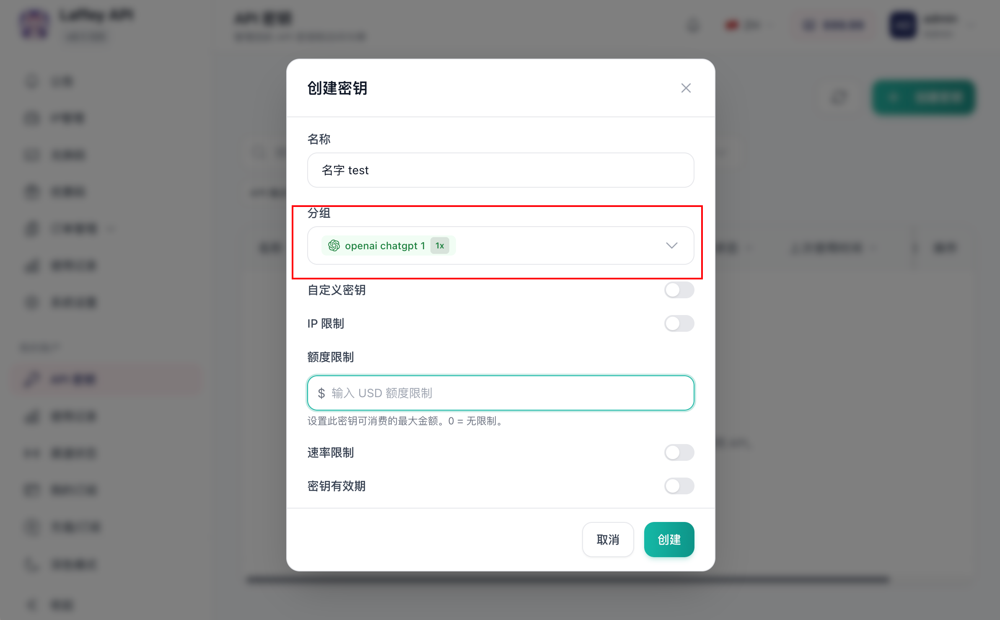

# Laffey API 使用手册

> 适用对象：第一次使用中转站、Codex、Claude Code、CC Switch 的用户。  
> 文档目标：照着做即可，不展开复杂原理。

## 目录

- [创建和管理](#开始前先准备)
- [中转站简介和计费模式](#第一部分中转站简介和计费模式)
- [安装CC Switch](#安装CCSwitch)
- [配置Codex](#配置Codex)
- [配置Cluade](#配置Claude)
- [常见问题](#常见问题)

## 简介和计费模式

本站的用法可以理解为：你不用把真实账号直接配置到每个工具里，只需要使用LaffeyAPI发给你的中转地址和API Key。

### 常见计费方式

| 方式 | 用户要做什么 | 用完会怎样 |
|---|---|---|
| 余额计费 | 先充值，使用时自动扣余额 | 余额不足后请求会失败 |
| 管理员赠送 | 管理员给账号加余额或额度 | 用完后需要充值或续订 |

### 用量在哪里看

1. 登录 Laffey API, 进入 **仪表盘**。
2. 查看模型、时间、Token、费用、状态。
4. 如果某次请求失败，先看错误信息，再看余额和分组是否正确。
## 开始前先准备

### 登录、充值和创建 API Key
3. 登录账号。
4. 进入 **充值/订阅**，完成充值，或确认你的订阅还有可用额度。
5. 进入左侧 **我的账户** ，点击**API 密钥**，接着点击 **创建密钥**。

6. 名称填写，例如：
   - `Codex 日常使用`
   - `Claude Code 编程`
7. 重点是选择对应分组：
   - 用 Chatgpt/Codex：选OpenAI 分组。
   - 用 Claude Code：选 Claude / Anthropic 分组。
   
8. 点击创建后，获得一个`sk-...` 密钥。

> API Key 可以任意创建，任意复制，随时可以回来取

## 安装CCSwitch

CC Switch 用来保存多个服务商配置，并在 Codex / Claude 等 agent 之间切换。强烈建议先安装它，后面配置 Codex CLI 和 Claude Code 会更省事。

下载链接：[CC Switch 官网](https://ccswitch.ai/) / [GitHub Releases](https://github.com/farion1231/cc-switch/releases) / [国内网盘下载](https://1drv.ms/f/c/90f4cc5b88f514bf/IgCZ3hpZwYeaSb4WyYu414XJAS2-aNUItNCwhHlJWAsCZJI?e=Zhrieb)

## 配置Codex

### cc switch设置
【todo]

### 安装Codex App/Codex Cli
[todo: 提供app和cli的下载链接]
[todo: 讲一讲app和cli的简单区别]
[todo: 讲一讲App的简单用法]
[todo: 讲一讲Cli的简单用法]

## 配置Cluade

## 常见问题

### CC Switch 导入失败

按顺序检查：

1. 是否已经安装 CC Switch。
2. 是否打开过一次 CC Switch。
3. 浏览器是否拦截了 `ccswitch://` 链接。
4. Sub2API **设置 → 站点设置** 中是否隐藏了 CCS 导入按钮。
5. 当前 API Key 是否已经创建成功。

处理方式：

| 问题 | 处理 |
|---|---|
| 点击没反应 | 重新安装 CC Switch，并打开一次 |
| 浏览器弹窗被拦截 | 允许打开外部应用 |
| 提示未安装 | 检查 `ccswitch://` 协议是否注册 |
| 导入了但不能用 | 在 CC Switch 中确认已切到对应 provider |

### Codex CLI 不能用

按顺序检查：

1. `codex --version` 是否能显示版本。
2. `~/.codex/config.toml` 或 `%userprofile%\.codex\config.toml` 是否存在。
3. `auth.json` 里是否是你的 Sub2API Key。
4. `base_url` 是否是 `https://当前站点域名`，不要多写 `/v1`。
5. API Key 是否绑定 Codex / OpenAI 分组。

### Claude Code 不能用

按顺序检查：

1. `claude --version` 是否能显示版本。
2. `ANTHROPIC_BASE_URL` 是否是 `https://当前站点域名`。
3. `ANTHROPIC_AUTH_TOKEN` 是否是 `sk-你的API密钥`。
4. API Key 是否绑定 Claude / Anthropic 分组。
5. 如果在 Plan Mode 卡住，按 `Shift + Tab` 手动切换模式，再继续输入。

### API Key 泄露了怎么办

1. 立刻登录 Sub2API。
2. 进入 **API 密钥**。
3. 禁用或删除泄露的 Key。
4. 创建新的 Key。
5. 更新 CC Switch、Codex CLI、Codex App、Claude Code 里的配置。

### 换服务商或换分组怎么做

推荐方式：

1. 在 Sub2API 创建新的 API Key。
2. 点击 **导入到 CCS**。
3. 在 CC Switch 里切换到新的 provider。
4. 重新打开 Codex CLI 或 Claude Code。

手动方式：

1. 修改配置文件里的 API Key。
2. 修改配置文件里的中转站地址。
3. 关闭并重新打开客户端。

## 官方参考

- OpenAI Codex CLI Getting Started: <https://help.openai.com/en/articles/11096431-openai-codex-cli-getting-tarted>
- OpenAI Codex with ChatGPT plan: <https://help.openai.com/en/articles/11369540>
- OpenAI Codex developer resources: <https://developers.openai.com/codex/>
