# Laffey API 傻瓜式使用教程

> 适用对象：第一次使用中转站、Codex、Claude Code、CC Switch 的用户。
> 教程目标：先不用研究原理，照着做。每完成一节，只要对照“成功标志”确认通过，就继续下一节。

## 目录

- [Laffey API 傻瓜式使用教程](#laffey-api-傻瓜式使用教程)
  - [先看这一页](#先看这一页)
    - [你最终要完成什么](#你最终要完成什么)
    - [最推荐路线](#最推荐路线)
    - [先准备这些东西](#先准备这些东西)
    - [新手最容易弄错的地方](#新手最容易弄错的地方)
  - [计费模式](#计费模式)
    - [额度怎么理解](#额度怎么理解)
    - [额度来源](#额度来源)
    - [用量在哪里看](#用量在哪里看)
  - [第一步：登录、充值、创建 API Key](#第一步登录充值创建-api-key)
    - [1. 登录并确认有额度](#1-登录并确认有额度)
    - [2. 创建 API Key](#2-创建-api-key)
    - [3. 选择正确分组](#3-选择正确分组)
    - [4. 复制 API Key](#4-复制-api-key)
  - [第二步：安装 CC Switch](#第二步安装-cc-switch)
  - [第三步：把 Laffey API 导入 CC Switch](#第三步把-laffey-api-导入-cc-switch)
    - [给 Codex 用的导入方法](#给-codex-用的导入方法)
    - [给 Claude Code 用的导入方法](#给-claude-code-用的导入方法)
  - [第四步：配置 Codex](#第四步配置-codex)
    - [先选 Codex App 还是 Codex CLI](#先选-codex-app-还是-codex-cli)
    - [Codex App 安装](#codex-app-安装)
    - [Codex App 使用：写一个 Hello World](#codex-app-使用写一个-hello-world)
    - [Codex CLI 安装](#codex-cli-安装)
    - [Codex CLI 使用：写一个 Hello World](#codex-cli-使用写一个-hello-world)
    - [Codex 常用命令](#codex-常用命令)
  - [第五步：配置 Claude Code](#第五步配置-claude-code)
    - [Claude Code 安装](#claude-code-安装)
    - [Claude Code 使用：写一个 Hello World](#claude-code-使用写一个-hello-world)
    - [Claude Code 常用命令](#claude-code-常用命令)
  - [常见问题](#常见问题)
    - [CC Switch 导入失败](#cc-switch-导入失败)
    - [Codex CLI 不能用](#codex-cli-不能用)
    - [Claude Code 不能用](#claude-code-不能用)
    - [API Key 泄露了怎么办](#api-key-泄露了怎么办)
    - [换服务商或换分组怎么做](#换服务商或换分组怎么做)

## 先看这一页

如果你是第一次用，只需要记住一句话：

```text
先在 LaffeyAPI 创建 Key，再用 CC Switch 导入 Key，最后打开 Codex 或 Claude Code 测试。
```

### 你最终要完成什么

这份教程会带你完成三件事：

1. 在 Laffey API 里充值，或者确认账号里已经有可用额度。
2. 创建一个 `sk-...` 开头的 API Key。
3. 用 CC Switch 保存这份 API 配置，让 Codex App、Codex CLI 或 Claude Code 通过 Laffey API 正常工作。

你不需要一开始就理解“中转”“Base URL”“环境变量”这些概念。先按步骤完成，能跑通之后，再回头看原理也来得及。

### 最推荐路线

新手按下面顺序做，不要跳步：

1. 完成 **第一步：登录、充值、创建 API Key**。
2. 完成 **第二步：安装 CC Switch**。
3. 在 Laffey API 的 **API 密钥** 页面点击 **导入到 CCS**。
4. 如果你用 Codex，继续看 **第四步：配置 Codex**。
5. 如果你用 Claude Code，继续看 **第五步：配置 Claude Code**。

> 新手建议优先使用 CC Switch 导入，不建议一开始手动改配置文件。手动方式只放在常见问题里排查用。

### 新手最容易弄错的地方

开始之前先看这几条，可以少踩很多坑：

1. **Codex 和 Claude Code 要用不同分组的 Key。**
   - Codex / Codex App / Codex CLI：选 OpenAI 分组。
   - Claude Code：选 Claude / Anthropic 分组。
2. **刚切换 CC Switch 供应商后， 要重新打开应用/终端。**
   - 已经打开的旧终端可能读不到新配置。
3. 

## 计费模式

### 额度怎么理解

本站的用法可以简单理解为：

1. 你不需要把真实账号直接配置到 Codex、Claude Code 等工具里。
2. 你只需要使用 Laffey API 发给你的中转地址和 API Key。
3. 实际请求产生的费用，会从你的站内额度里扣除。

本站的站内额度以 **美元额度（USD）** 显示和扣减，但充值入口使用人民币金额。当前换算规则为：

```text
0.2 RMB 充值 = 1 USD 站内额度
```

例子：

```text
充值 10 RMB
= 到账 100 USD 站内额度
= 后续使用 Codex、Claude Code 或其他兼容客户端时，从这 100 USD 里扣费
```

你可以把它理解成手机话费：先充值，有余额；每次请求模型，都会按实际用量扣一点。

### 额度来源

| 来源       | 说明                           | 到账形式                                       |
| ---------- | ------------------------------ | ---------------------------------------------- |
| 在线充值   | 通过站内充值入口支付人民币     | 按 1 RMB = 1 USD 换算为站内美元额度            |
| 优惠券     | 活动、补偿或人工发放的优惠     | 折算为站内美元额度                             |
| 兑换码     | 输入管理员发放的兑换码         | 可兑换为站内美元额度，也可能包含并发或订阅权限 |
| 管理员赠送 | 管理员直接为账号增加余额或额度 | 按站内美元额度显示                             |

## 第一步：登录、充值、创建 API Key

这一节要做的是：让你的账号里有钱，并拿到一个可以给工具使用的 Key。

### 1. 登录并确认有额度

照着做：

1. 打开 Laffey API 网站并登录。
2. 进入 **充值/订阅**。
3. 完成充值，或确认你的订阅还有可用额度。

成功标志：

```text
账号里有可用额度，后面请求才有钱可扣。
```

如果你还没有充值，后面即使 Key 创建成功，也可能因为余额不足而请求失败。

### 2. 创建 API Key

照着做：

1. 进入左侧 **我的账户**。
2. 点击 **API 密钥**。
3. 点击 **创建密钥**。

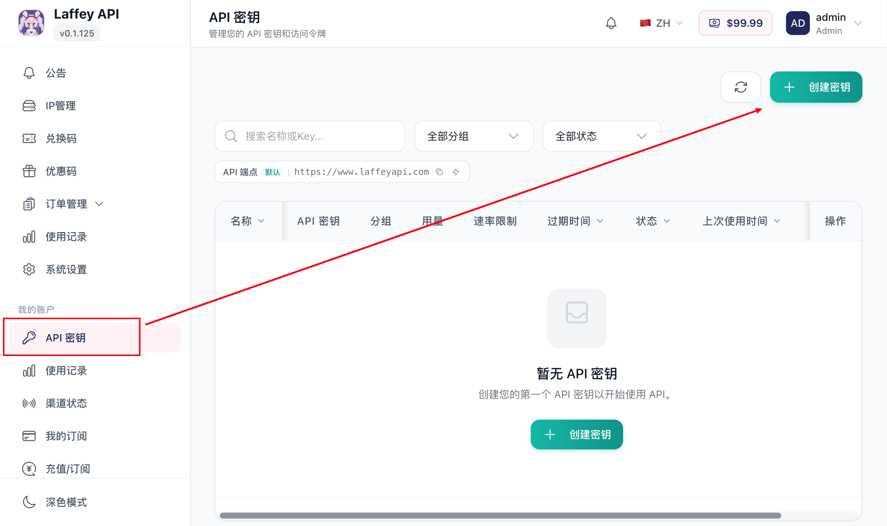

4. 名称随便填一个自己能看懂的，例如：

   - `Codex 日常使用`
   - `Claude Code 编程`

建议名称写清楚用途。以后 Key 多了，看到名字就知道哪个是给 Codex 用的，哪个是给 Claude Code 用的。

### 3. 选择正确分组

创建 API Key 时，最重要的是选对分组。

| 你要用什么                              | 应该选什么分组          |
| --------------------------------------- | ----------------------- |
| ChatGPT / Codex / Codex App / Codex CLI | OpenAI 分组             |
| Claude Code                             | Claude / Anthropic 分组 |


注意：

- Codex 用的 Key 不要绑到 Claude / Anthropic 分组。
- Claude Code 用的 Key 不要绑到 OpenAI / Codex 分组。
- 如果分组选错，工具可能安装正常，但请求会失败。

最简单的记法：

```text
Codex 看 OpenAI。
Claude Code 看 Claude / Anthropic。
```

### 4. 复制 API Key

照着做：

1. 点击创建后，你会获得一个 `sk-...` 开头的密钥。
2. 复制它，后面导入 CC Switch 会用到。

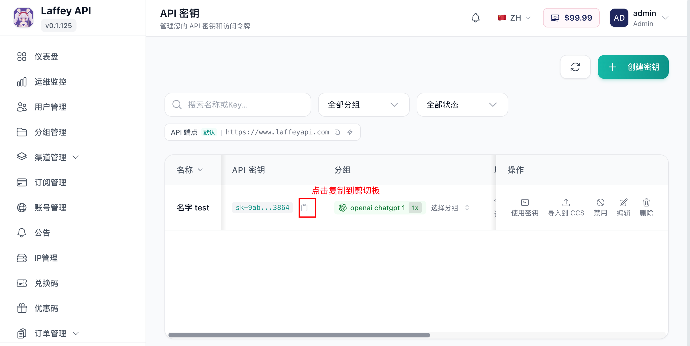

成功标志：

```text
你已经拿到一个 sk-... 开头的 API Key。
```

> API Key 可以创建多个，也可以随时回来复制。建议 Codex 和 Claude Code 分别创建不同的 Key，方便以后排查和停用。

## 第二步：安装 CC Switch

这一节要做的是：安装一个配置切换工具。后面你不用每个客户端都手动填地址和 Key，交给 CC Switch 管理即可。

CC Switch 用来保存多个服务商配置，并在 Codex / Claude 等 agent 之间切换。强烈建议先安装它，后面配置 Codex CLI 和 Claude Code 会更省事。

下载链接：

- [CC Switch 官网](https://ccswitch.ai/)
- [GitHub Releases](https://github.com/farion1231/cc-switch/releases)
- [国内网盘下载](https://1drv.ms/f/c/90f4cc5b88f514bf/IgCZ3hpZwYeaSb4WyYu414XJAS2-aNUItNCwhHlJWAsCZJI?e=Zhrieb)  【提取码：1234】

照着做：

1. 从上面一个链接下载 CC Switch。
2. 安装 CC Switch。
3. 安装完成后，先打开一次 CC Switch。
4. 如果系统询问是否允许运行，选择允许。

如果后面点击 **导入到 CCS** 没反应，通常就是下面几种原因：

1. CC Switch 没装好。
2. CC Switch 安装后没有打开过。

## 第三步：把 Laffey API 导入 CC Switch

这一节的目标是：把你刚才创建的 Laffey API Key 导入到 CC Switch，让 CC Switch 帮你管理服务商配置。

照着做：

1. 回到 Laffey API 网站。
2. 进入左侧 **我的账户 → API 密钥**。
3. 点击右侧 **导入到 CCS**。

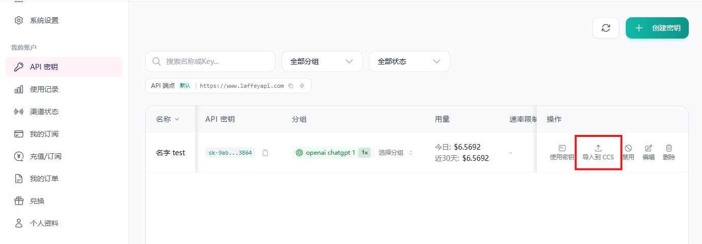

4. 浏览器弹出“是否允许打开 CC Switch”或类似提示时，选择 **允许**。

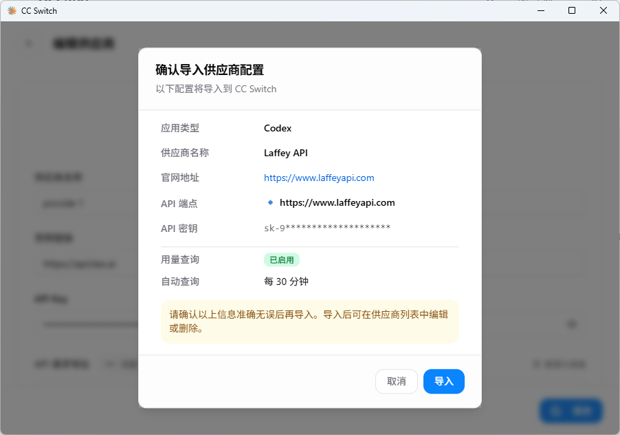

7. CC Switch 打开后，点击上方模型图标，启动导入的供应商配置。
8. 切换完成后，Codex App 和 Codex CLI 都可以使用这个中转配置。

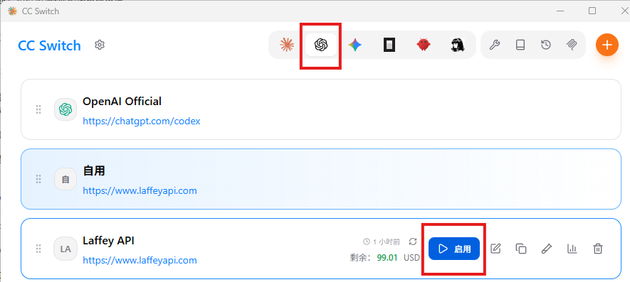

成功标志：

```text
CC Switch 里出现了 Laffey API / Codex 供应商，并且已经切换到它。
```

如果浏览器没有弹窗，或者点击后没有反应，按顺序检查：

1. 确认 CC Switch 已经安装。
2. 确认 CC Switch 已经打开过一次。
3. 确认浏览器允许打开外部应用。
4. 确认系统能识别 `ccswitch://` 这种外部应用链接。

## 第四步：配置 Codex

这一节适合想使用 Codex 的用户。

Codex 可以通过官方 App 使用，也可以通过 Codex CLI 在终端里使用。Laffey API 同时支持这两种方式。

使用 Laffey API 中转时，请在 Codex App 或 Codex CLI 中选择刚才通过 CC Switch 导入的 Laffey API 供应商。

### 先选 Codex App 还是 Codex CLI

| 对比项   | Codex App                            | Codex CLI                                   |
| -------- | ------------------------------------ | ------------------------------------------- |
| 使用方式 | 图形界面操作                         | 终端输入命令                                |
| 适合场景 | 看任务、审查代码、用图形界面管理任务 | 在项目目录中让 Codex 直接读写文件、运行测试 |
| 排错难度 | 界面友好，但底层配置不一定可见       | 配置文件清晰，适合排查 Base URL / Key 问题  |
| 新手建议 | 不想碰命令行，先用 App               | 愿意打开终端，想让它直接操作项目文件        |

如果你不知道该选哪个：

1. 不想碰命令行，先选 **Codex App**。
2. 想让 Codex 直接在项目文件夹里创建、修改、运行文件，选 **Codex CLI**。
3. 两个都可以用；它们都可以通过 CC Switch 使用 Laffey API。

### Codex App 安装

Codex App 建议直接下载安装包。普通用户不需要打开命令行，也不需要手动安装 Node.js。

| 下载方式                | 链接                                                                          | 说明                               |
| ----------------------- | ----------------------------------------------------------------------------- | ---------------------------------- |
| 官网下载                | [OpenAI Codex 官网](https://openai.com/codex/)                                   | 进入页面后点击 Download 下载       |
| 微软商店下载            | [Microsoft Store](https://apps.microsoft.com/detail/9plm9xgg6vks?hl=en-US&gl=CN) | Windows 用户可在微软商店搜索 CodeX |
| （MAC/WIN) 国内网盘下载 | [网盘下载【提取码：1234】](https://www.apple.com/app-store/)                     | macOS 用户可在苹果商店搜索 Codex   |

照着做：

1. 打开上面任意一个下载入口。
2. 下载并安装 Codex App。
3. 安装完成后，打开 Codex App。

成功标志：

```text
你能打开 Codex App。
```

### Codex App 使用：写一个 Hello World

下面只做一个最小示例：让 Codex App 在空文件夹里写一个 `helloworld.py`。这个示例的目的不是学 Python，而是确认 Codex App 已经能通过 Laffey API 正常工作。

照着做：

1. 打开 CC Switch。
2. 确认当前供应商已经切换到 Laffey API / Codex。
3. 打开 Codex App。
4. 新建一个空文件夹，例如：

   ```text
   helloworld
   ```
5. 在 Codex App 里添加项目，选择刚才新建的 `helloworld` 文件夹。
6. 在 Codex App 输入框附近找到模式选择。
7. 把模式切换为 **Plan / 计划**。

   这个模式会先让 Codex 给出方案，不会立刻改文件。

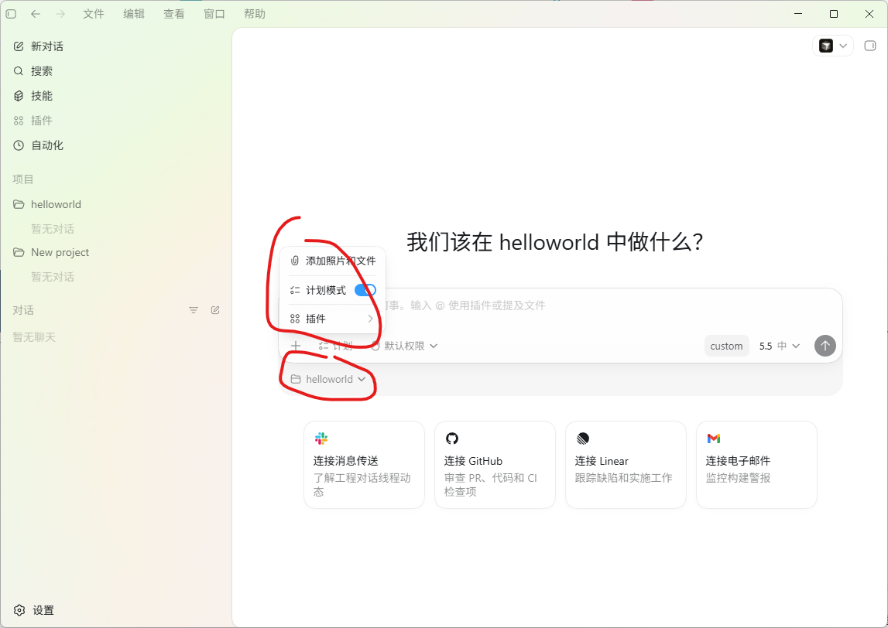

8. 在输入框里输入：

   ```text
   请为当前文件夹里的 Python Hello World 示例制定一个简短计划。
   目标：
   1. 新建 helloworld.py
   2. 内容输出 Hello, world!
   3. 新建 README.md，说明如何运行
   ```
9. Codex 会返回一个执行计划文本。

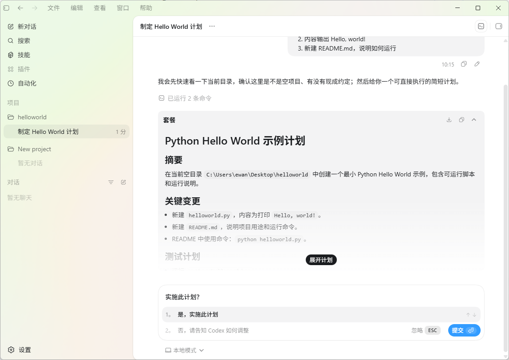

10. 先阅读 Codex 给出的计划。
11. 如果计划不符合预期，选择否，继续和 Codex 对话修改需求。
12. 如果计划合适，选择实施计划。示例里选择 **是，实施此计划**。
13. Codex 会自动切出 Plan 模式并开始创建代码。
14. 完成后，可以看到 Codex 生成了一个 `helloworld.py` 文件。

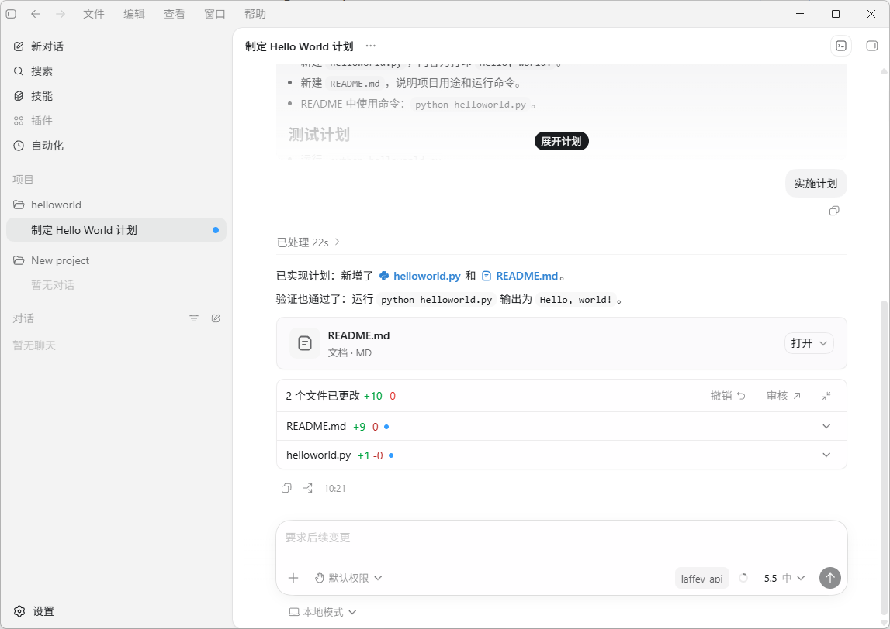

15. 让 Codex 直接运行代码并展示结果。

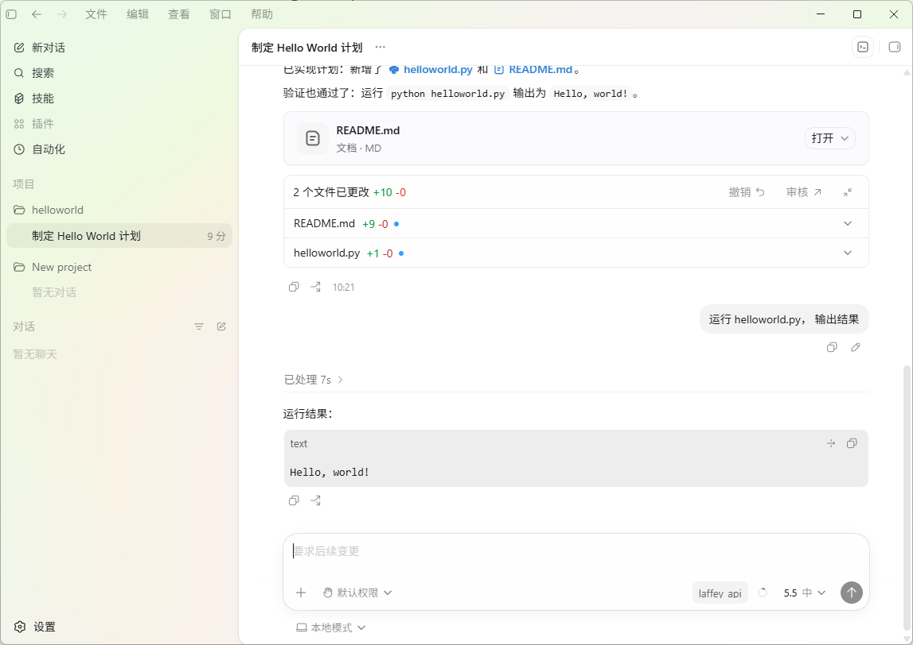

成功标志：

```text
程序正常输出 Hello, world!
```

后续如果新增或更换了 API Key：

1. 回到 Laffey API 的 **API 密钥** 页面。
2. 重新点击 **导入到 CCS**。
3. 在 Codex App 中切换到新的 Laffey API 供应商。

### Codex CLI 安装

Codex CLI 的使用方式是：在终端进入项目目录，运行 `codex`，然后把任务交给它。

Codex CLI 需要先安装 Node.js 和 npm，或者在 macOS 上使用 Homebrew 直接安装。

#### Windows 安装 Codex CLI

照着做：

1. 进入 [Node.js 官网](https://nodejs.org/)。
2. 下载并安装 Node.js。
3. 安装完成后，打开 PowerShell。

   点击 Windows 开始菜单，搜索 `PowerShell`，打开 **Windows PowerShell**。

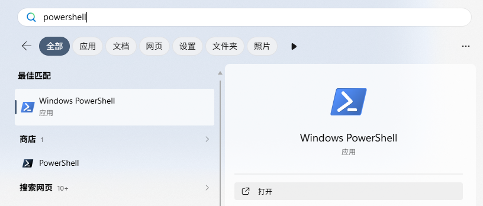

4. 检查 Node.js 和 npm 是否安装成功。
5. 在 PowerShell 中输入下面两行命令，每输入一行按一次回车：

   ```powershell
   node -v
   npm -v
   ```
6. 如果两行都显示版本号，例如 `v22.x.x` 和 `10.x.x`，说明安装成功。
7. 如果提示找不到命令，关闭 PowerShell 后重新打开再试一次。

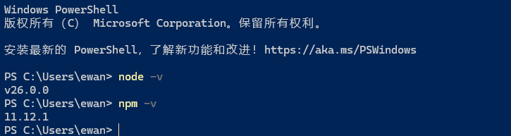

8. 安装 Codex CLI。继续在 PowerShell 中输入：

   ```powershell
   npm install -g @openai/codex --registry=https://registry.npmmirror.com
   ```
9. 这一步可能需要等待几十秒到几分钟。
10. 等命令执行结束，重新出现可以输入命令的提示符后，再继续下一步。
11. 检查 Codex CLI 是否安装成功：

```powershell
   codex --version
```

12. 如果能显示版本号，说明 Codex CLI 安装成功。

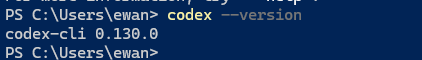

成功标志：

```text
codex --version 能显示版本号。
```

如果 `node -v` 或 `npm -v` 找不到命令，通常不是 Codex 的问题，而是 Node.js 没安装好，或者安装后没有重新打开 PowerShell。

#### macOS 安装 Codex CLI，方式一：Homebrew

如果你已经安装 Homebrew，优先用这种方式。

照着做：

1. 打开终端。
2. 执行：

   ```bash
   brew install --cask codex
   ```
3. 检查 Codex CLI 是否安装成功：

   ```bash
   codex --version
   ```

成功标志：

```text
codex --version 能显示版本号。
```

如果没有安装 Homebrew，请看下一种方式。

#### macOS 安装 Codex CLI，方式二：Node.js / npm

照着做：

1. 进入 [Node.js 官网](https://nodejs.org/)。
2. 下载并安装 Node.js。
3. 打开终端。
4. 执行：

   ```bash
   npm install -g @openai/codex
   ```
5. 检查 Codex CLI 是否安装成功：

   ```bash
   codex --version
   ```

成功标志：

```text
codex --version 能显示版本号。
```

### Codex CLI 使用：写一个 Hello World

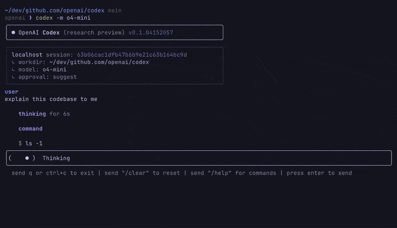

下面做一个最小测试：让 Codex CLI 在一个新文件夹里创建 `hello.py` 和 `README.md`。

照着做：

1. 打开 CC Switch。
2. 确认当前供应商是刚才导入的 Laffey API / Codex 供应商。
3. 如果你刚刚改过供应商，关闭旧的终端窗口，重新打开一个新终端。
4. 创建一个测试目录并进入。

   Windows PowerShell：

   ```powershell
   mkdir hello-codex
   cd hello-codex
   ```

   macOS / Linux 终端：

   ```bash
   mkdir hello-codex
   cd hello-codex
   ```
5. 启动 Codex CLI：

   ```bash
   codex
   ```
6. 在 Codex CLI 里先使用计划模式。

   部分版本会在启动后提供模式选择，可以先选择 **Plan / 计划**。如果没有看到模式选择，就直接输入下面的任务，让 Codex 只给计划、不要马上改文件：

   ```text
   请先使用计划模式，为当前目录里的 Python Hello World 示例制定一个简短计划。
   暂时不要修改文件。
   目标：
   1. 新建 hello.py
   2. 内容输出 Hello, Laffey API!
   3. 新建 README.md，说明运行命令
   ```
7. 如果 Codex 能正常给出计划，说明 Codex CLI 已经能通过 Laffey API 工作。
8. 阅读计划，确认它只会创建 `hello.py` 和 `README.md`。
9. 如果 CLI 有模式选择，可以切回 **Code / 执行**。
10. 在 Codex CLI 里回复：

```text
   计划没问题，请按这个计划执行。
```

11. 按 Codex CLI 的提示查看并接受修改。
12. 完成后目录里应当至少有：

```text
   hello.py
   README.md
```

13. `hello.py` 预期内容类似：

```python
   print("Hello, Laffey API!")
```

14. 退出 Codex CLI 后运行：

   Windows PowerShell：

```powershell
   python hello.py
```

   macOS / Linux 终端：

```bash
   python3 hello.py
```

15. 看到下面输出即表示成功：

```text
   Hello, Laffey API!
```

成功标志：

```text
Codex CLI 能创建文件，并且 hello.py 能正常运行。
```

如果 Codex CLI 能打开，但请求失败，优先检查这三件事：

1. CC Switch 是否切换到了 Laffey API / Codex 供应商。
2. 终端是否是在切换供应商之后重新打开的。
3. API Key 是否绑定 OpenAI / Codex 分组，账号余额是否足够。

### Codex 常用命令

| 命令                             | 用途                                |
| -------------------------------- | ----------------------------------- |
| `codex`                        | 正常启动，适合第一次使用            |
| `codex app`                    | 启动 Codex App                      |
| `codex --version`              | 查看版本，确认是否安装成功          |
| `npm install -g @openai/codex` | 重新安装或升级 npm 版本的 Codex CLI |

## 第五步：配置 Claude Code

这一节适合想使用 Claude Code 的用户。

Claude Code 是在终端里使用的编程 agent，适合让它阅读项目、修改代码、运行命令。

Laffey API 支持 Claude / Anthropic 分组。使用前请先创建一个绑定 Claude / Anthropic 分组的 API Key，并按前面的步骤导入 CC Switch。

### Claude Code 安装

Claude Code 需要先安装 Node.js 18 或更新版本。

#### Windows 安装 Claude Code

照着做：

1. 进入 [Node.js 官网](https://nodejs.org/)。
2. 下载并安装 Node.js。
3. 安装完成后，打开 PowerShell。

   点击 Windows 开始菜单，搜索 `PowerShell`，打开 **Windows PowerShell**。


4. 检查 Node.js 和 npm 是否安装成功。
5. 在 PowerShell 中输入下面两行命令，每输入一行按一次回车：

   ```powershell
   node -v
   npm -v
   ```
6. 如果两行都显示版本号，例如 `v22.x.x` 和 `10.x.x`，说明安装成功。
7. 如果提示找不到命令，关闭 PowerShell 后重新打开再试一次。


8. 安装 Claude Code。继续在 PowerShell 中输入：

   ```powershell
   npm install -g @anthropic-ai/claude-code --registry=https://registry.npmmirror.com
   ```
9. 这一步使用国内 npm 镜像，可能需要等待几十秒到几分钟。
10. 等命令执行结束，重新出现可以输入命令的提示符后，再继续下一步。
11. 检查是否安装成功：

```powershell
   claude --version
```

成功标志：

```text
claude --version 能显示版本号。
```

如果 `claude --version` 找不到命令，先关闭 PowerShell 再重新打开。如果仍然不行，再检查 Node.js 和 npm 是否安装成功。

#### macOS 安装 Claude Code

照着做：

1. 确认已经安装 Node.js 18 或更新版本。
2. 打开终端。
3. 执行：

   ```bash
   npm install -g @anthropic-ai/claude-code
   ```
4. 检查是否安装成功：

   ```bash
   claude --version
   ```

成功标志：

```text
claude --version 能显示版本号。
```

### Claude Code 使用：写一个 Hello World

下面只做一个最小示例：让 Claude Code 在空文件夹里写一个 `hello.py`。这个示例的目的，是确认 Claude Code 已经能通过 Laffey API 正常工作。

照着做：

1. 打开 CC Switch。
2. 确认当前 Claude / Anthropic 供应商已经切换到 Laffey API。
3. 如果你刚刚改过供应商，关闭旧终端，重新打开一个新终端。
4. 创建一个测试目录并进入。

   Windows PowerShell：

   ```powershell
   mkdir hello-claude
   cd hello-claude
   ```

   macOS 终端：

   ```bash
   mkdir hello-claude
   cd hello-claude
   ```
5. 启动 Claude Code：

   ```bash
   claude
   ```
6. 先进入计划模式。

   Claude Code 通常可以按 `Shift + Tab` 在不同模式之间切换。切到 **Plan Mode / 计划模式** 后再输入：

   ```text
   请先为当前目录里的 Python Hello World 示例制定一个简短计划。
   暂时不要修改文件。
   目标：
   1. 新建 hello.py
   2. 内容输出 Hello, Laffey API!
   3. 新建 README.md，说明运行命令
   ```
7. 阅读计划，确认它只会创建 `hello.py` 和 `README.md`。
8. 按 `Shift + Tab` 切回可执行修改的模式。
9. 回复：

   ```text
   计划没问题，请按这个计划执行。
   ```
10. 按 Claude Code 的提示查看并接受修改。
11. 完成后目录里应当至少有：

```text
   hello.py
   README.md
```

12. `hello.py` 预期内容类似：

```python
   print("Hello, Laffey API!")
```

13. 退出 Claude Code 后运行：

   Windows PowerShell：

```powershell
   python hello.py
```

   macOS 终端：

```bash
   python3 hello.py
```

14. 看到下面输出即表示成功：

```text
   Hello, Laffey API!
```

成功标志：

```text
Claude Code 能创建文件，并且 hello.py 能正常运行。
```

如果 Claude Code 能打开，但请求失败，优先检查这三件事：

1. CC Switch 是否切换到了 Claude / Anthropic 对应的 Laffey API 供应商。
2. 终端是否是在切换供应商之后重新打开的。
3. API Key 是否绑定 Claude / Anthropic 分组，账号余额是否足够。

### Claude Code 常用命令

| 命令                                         | 用途                                  |
| -------------------------------------------- | ------------------------------------- |
| `claude`                                   | 正常启动 Claude Code                  |
| `claude --version`                         | 查看版本，确认是否安装成功            |
| `/login`                                   | 在 Claude Code 内重新登录或切换账号   |
| `npm install -g @anthropic-ai/claude-code` | 重新安装或升级 npm 版本的 Claude Code |

## 常见问题

### CC Switch 导入失败

按顺序检查：

1. 是否已经安装 CC Switch。
2. 是否打开过一次 CC Switch。
3. 浏览器是否拦截了 `ccswitch://` 链接。
4. Sub2API **设置 → 站点设置** 中是否隐藏了 CCS 导入按钮。
5. 当前 API Key 是否已经创建成功。
6. 当前 API Key 是否选对了分组。

处理方式：

| 问题                         | 处理                                                     |
| ---------------------------- | -------------------------------------------------------- |
| 点击没反应                   | 重新安装 CC Switch，并打开一次                           |
| 浏览器弹窗被拦截             | 允许打开外部应用                                         |
| 提示未安装                   | 检查 `ccswitch://` 协议是否注册                        |
| 导入了但不能用               | 在 CC Switch 中确认已切到对应供应商                      |
| Codex 能导入但 Claude 不能用 | 检查 Claude Code 的 Key 是否绑定 Claude / Anthropic 分组 |
| Claude 能导入但 Codex 不能用 | 检查 Codex 的 Key 是否绑定 OpenAI / Codex 分组           |

最小排查顺序：

```text
先打开 CC Switch
再重新点导入到 CCS
再允许浏览器打开外部应用
最后检查 Key 是否选对分组
```

### Codex CLI 不能用

按顺序检查：

1. `codex --version` 是否能显示版本。
2. CC Switch 是否已经切换到 Laffey API / Codex 供应商。
3. 如果刚切换过供应商，是否关闭旧终端并重新打开新终端。
4. `~/.codex/config.toml` 或 `%userprofile%\.codex\config.toml` 是否存在。
5. `auth.json` 里是否是你的 Sub2API Key。
6. `base_url` 是否是 `https://当前站点域名`，不要多写 `/v1`。
7. API Key 是否绑定 Codex / OpenAI 分组。
8. 账号余额是否足够。

最小排查顺序：

```text
先跑 codex --version
再检查 CC Switch 是否切到 Laffey API / Codex
再重新打开终端
最后检查 Key、base_url、余额和分组
```

如果 `codex --version` 都不能显示版本，说明 Codex CLI 还没有安装好，先回到“Codex CLI 安装”重新检查 Node.js、npm 和安装命令。

### Claude Code 不能用

按顺序检查：

1. `claude --version` 是否能显示版本。
2. CC Switch 是否已经切换到 Claude / Anthropic 对应的 Laffey API 供应商。
3. 如果刚切换过供应商，是否关闭旧终端并重新打开新终端。
4. `ANTHROPIC_BASE_URL` 是否是 `https://当前站点域名`。
5. `ANTHROPIC_AUTH_TOKEN` 是否是 `sk-你的API密钥`。
6. API Key 是否绑定 Claude / Anthropic 分组。
7. 账号余额是否足够。
8. 如果在 Plan Mode 卡住，按 `Shift + Tab` 手动切换模式，再继续输入。

最小排查顺序：

```text
先跑 claude --version
再检查 CC Switch 是否切到 Claude / Anthropic 供应商
再重新打开终端
最后检查 ANTHROPIC_BASE_URL、ANTHROPIC_AUTH_TOKEN、余额和分组
```

如果 `claude --version` 都不能显示版本，说明 Claude Code 还没有安装好，先回到“Claude Code 安装”重新检查 Node.js、npm 和安装命令。

### API Key 泄露了怎么办

如果 API Key 被别人看到，立刻按下面做：

1. 登录 Sub2API / Laffey API。
2. 进入 **API 密钥**。
3. 禁用或删除泄露的 Key。
4. 创建新的 Key。
5. 确认新 Key 绑定正确分组。
6. 更新 CC Switch、Codex CLI、Codex App、Claude Code 里的配置。
7. 重新打开对应客户端。

成功标志：

```text
旧 Key 已经不能使用，新 Key 可以正常请求。
```

不要把 API Key 发给别人，也不要截图发到公开群里。只要别人拿到这个 Key，就可能消耗你的额度。

### 换服务商或换分组怎么做

推荐方式：

1. 在 Sub2API / Laffey API 创建新的 API Key。
2. 创建时选择新的分组。
3. 点击 **导入到 CCS**。
4. 在 CC Switch 里切换到新的供应商。
5. 重新打开 Codex CLI 或 Claude Code。

手动方式：

1. 修改配置文件里的 API Key。
2. 修改配置文件里的中转站地址。
3. 关闭并重新打开客户端。

新手建议使用推荐方式。只有在 CC Switch 无法导入或需要手动排查时，再使用手动方式。

最后再确认一次：

```text
Codex 用 OpenAI / Codex 分组。
Claude Code 用 Claude / Anthropic 分组。
切换供应商后，重新打开终端。
```
